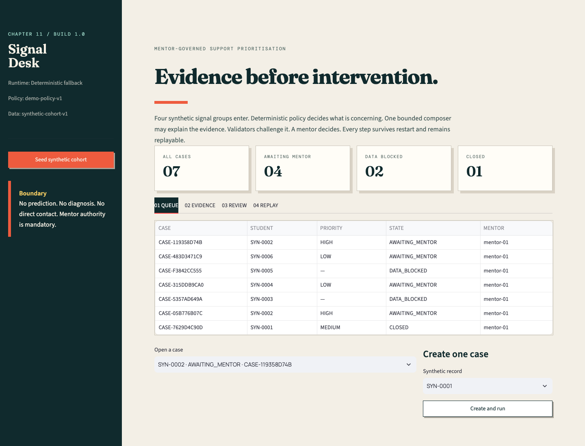

# AURA multi-portal rebuild

This branch is the implementation baseline for five independently deployed
websites: Student, Parent, Faculty, HOD, and AI Governance. The prior
single-application implementation remains below as legacy reference material;
it is not the target architecture on this branch.

Start with:

- `docs/FULL_COLLEGE_ECOSYSTEM_BUILD_PLAN.md`
- `docs/MULTI_PORTAL_ARCHITECTURE.md`
- `docs/FIVE_PORTAL_ACCEPTANCE_CONTRACT.md`
- `docs/PREREQUISITE_AUDIT.md`
- `docs/BOOTSTRAP_EVIDENCE.md`
- `platform/`

The live URLs currently serve independently deployed prerequisite shells. They
do not yet prove the functional course, academic-record, consent, casework, or
agent workflow described in the acceptance contract.

## Legacy single-portal reference

# AURA Student Success Ecosystem

A governed agentic AI capstone built from Chapter 11 of the *Agentic AI: 15 Worklets / 14-Lab Build Book* and the supplied *Student Success and Early Warning System* brief.



This is a **synthetic-data educational demonstration**. It joins source operations, cohort triage, mentor casework, intervention tracking, a self-scoped student portal, aggregate leadership analytics, agent operations, and governance. It does not predict student failure, diagnose wellbeing, contact students, or alter institutional records.

## Ecosystem surfaces

- **AURA Operations:** ecosystem map, cohort command centre, connector and agent operations, policy, role provisioning, and audit. Surface previews are read-only.
- **Faculty Mentor:** assigned worklist, evidence, validated recommendations, human decisions, correction/replay, and intervention delivery.
- **Synthetic Student:** only that identity's approved support and source-update status, with no peer comparison or predictive label.
- **Synthetic Parent:** one ward's academic summary and approved support, without mentor notes.
- **HoD / Dean:** aggregate trends and outcomes with no student-level drill-down.

Clerk provides signup, login, session handling, and protected routes. Neon maps
each Clerk user ID to one server-owned application role. The first account
bootstraps the prototype Operations owner; later accounts start as Student until
Operations records a new synthetic assignment. Browser input cannot elevate a
role. Operations may inspect every surface projection but cannot approve cases
or update mentor-owned interventions.

The deployed Next.js surface shares one versioned Neon Postgres ledger. Mentor
decisions, interventions, agent cycles, and audit events therefore persist across
browsers and sessions. Append-only tables retain role changes, source snapshots,
model inputs and outputs, critic results, repairs, mentor decisions, audit events,
and operational follow-ups. A database trigger rejects intervention creation
unless it references an approved mentor decision.

## Web application

```bash
npm install
npm run db:migrate
npm run dev
```

The responsive application opens at `http://localhost:3000`. Clerk and database
variables are supplied by the Vercel Marketplace integrations and remain in the
ignored `.env.local` file. The public runtime consists of:

- Next.js server-rendered UI and authenticated route handlers on Vercel;
- Clerk development and production instances for signup and login;
- Neon Postgres for shared case, intervention, run, and audit state;
- a bounded server agent graph: authorised source collector, data-quality gate,
  deterministic support eligibility, schema-constrained LLM composer, critic,
  one repair, mentor interrupt, intervention ledger, follow-up, and replay.

The deployed composer routes through Vercel AI Gateway using OIDC and defaults to
`openai/gpt-5.6-luna`. If Gateway is unavailable, the workflow fails closed to a
labelled deterministic template and records the degraded run. The model may
explain or rank only supports already made eligible by versioned code. It cannot
approve support, contact anyone, alter records, diagnose wellbeing, or predict
failure.

## Python reference runtime

```bash
uv sync --python 3.12 --extra dev
uv run student-success demo
uv run streamlit run src/student_success/ui/app.py
```

The Streamlit reference UI opens at `http://localhost:8501`. Its default offline
mode is the deterministic baseline/fallback. Set `OPENAI_API_KEY` and optionally
`OPENAI_MODEL` to exercise the schema-constrained LLM composer:

```bash
OPENAI_API_KEY=... uv run streamlit run src/student_success/ui/app.py
```

On an empty runtime database, the interface automatically creates a synthetic
demo cohort. No student data or API key is required. Deployment and rollback
instructions are in `docs/DEPLOYMENT.md`.

## Verify

```bash
npm run lint
npm run build
npm audit
npm test
npm run test:db-invariants
npm run test:agent
uv run pytest
uv run pytest --cov=student_success --cov-report=term-missing
```

## CLI

```bash
uv run student-success seed
uv run student-success create SYN-0001 --mentor mentor-01
uv run student-success run CASE-XXXXXXXXXX
uv run student-success decide CASE-XXXXXXXXXX approve --mentor mentor-01 --reason "Evidence reviewed"
uv run student-success rollback CASE-XXXXXXXXXX --version 1 --mentor mentor-01 --reason "Restore reviewed packet"
uv run student-success export CASE-XXXXXXXXXX
uv run student-success evaluate
```

`PROJECT_CONTRACT.md` is the authority for the case workflow. `docs/ECOSYSTEM_CONTRACT.md` defines the role surfaces, intervention lifecycle, aggregate boundaries, and ecosystem acceptance criteria. `docs/ADR-001-governed-agentic-runtime.md` records why the implementation uses a deterministic spine. `active/council-transcript-20260902-hosted-agentic-architecture.md` records the five-advisor council, anonymous review, and chairman verdict that governs the hosted build.

The build evidence is in `artifacts/reports/BUILD_EVIDENCE.md`; the lab-by-lab map is in `docs/REQUIREMENTS_TRACEABILITY.md`.
