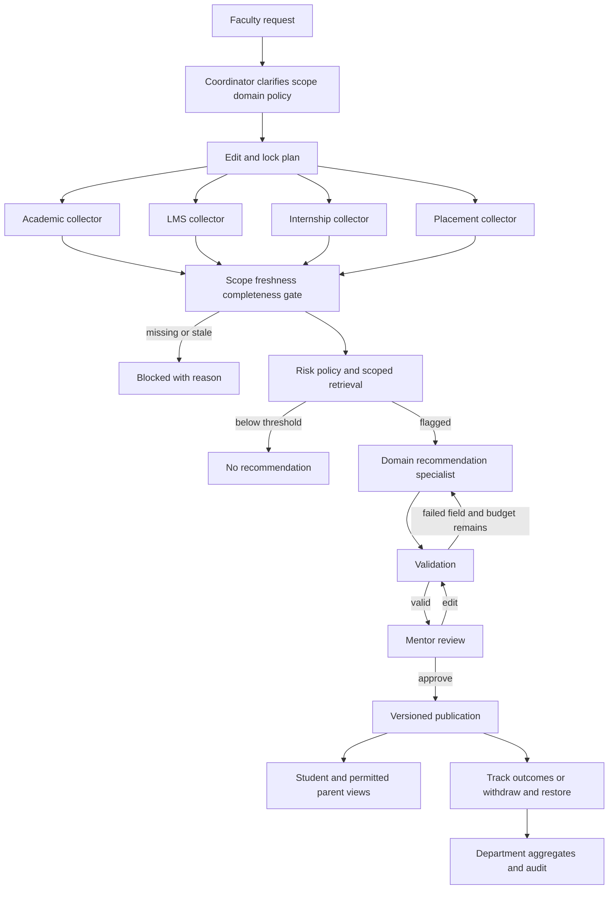

# Student Success and Early Warning System

## Abstract

This project implements the coordinator-and-workers method in Chapter 11 of the Agentic AI 15 Worklets 14 Lab Build Book. Four collectors normalize academic, learning engagement, internship and placement signals. A transparent policy identifies cases for mentor review. Recommendation specialists produce structured actions with evidence citations. Automated validation, bounded repair, saved checkpoints and a mandatory mentor decision control publication. Five role-specific portals use a shared PostgreSQL backend.

The implemented demonstration uses synthetic records. Its software acceptance evidence must be distinguished from the book's requirement for a real-case pilot and approval by an actual academic advisor.

## Problem and objective

Student support information is fragmented. Attendance alone cannot explain whether a student also has overdue learning activities or missed internship milestones. The objective is to combine the signals into one reviewable case and track what a mentor decides to do. The score is a review trigger, not a diagnosis, prediction of failure or automated disciplinary decision.

## Architecture and agent responsibilities

The TypeScript coordinator in `platform/services/core-api/lib/chapter11/service.ts` owns editable plans, locked plan hashes, job claims, checkpoints and audit events. The engine in `engine.ts` contains typed contracts, risk calculations, reusable skills, retrieval, specialist registration, validation and targeted repair. `provider.ts` is the bounded model adapter. `review.ts` handles mentor edits, outcomes and withdrawal or restoration of approved publications.

The academic collector normalizes attendance and published assessment marks from the shared institutional simulation. Three other collectors read normalized LMS, internship and placement fixtures through the same authorized source interface. Collectors execute concurrently. Student jobs run with a concurrency limit of four, and results retain their original order.

The risk worker applies the selected versioned mentor policy. The recommendation worker uses one of three domain packs: academic support, attendance support, or optional wellbeing referral. The model may choose and order permitted actions and assign a due interval within the approved range. Factual summary text and citations are restricted to evidence-derived statements. No worker independently contacts a student or changes an academic record.

## Data and scoring

Each source has a student ID, source name, record ID, observation time, semester, presence status, synthetic-data label and normalized values. Academic and LMS evidence are mandatory. An internship or placement source may explicitly be not applicable; a missing expected record blocks execution instead of being silently treated as zero.

The demonstration policy flags attendance below 75 percent, marks below 60 percent, LMS inactivity of at least seven days, and one or more overdue assignments or missed career activities. Weights are 20 for attendance, 20 for marks, 20 for inactivity, 10 for overdue assignments, 15 for internship milestones and 15 for placement activities. Medium concern starts at 20 and high concern at 50. Thresholds and their rationale are versioned under the synthetic mentor identity. These values are demonstration choices, not a validated predictive model or institutional policy.

## Memory and retrieval

Execution checkpoints live in job rows. Reference knowledge is separate: tagged guidance plus the same student's prior support plans. Retrieval filters department and student scope before cosine ranking over reproducible 128-dimensional lexical hash embeddings. The recorded embedding identifier is `sha256-lexical-128-v1`. This is lexical similarity, not a pretrained semantic embedding. Each selected reference and its score is retained in the evidence record.

## Reliability and governance

Plans cannot change after locking. Workers use leased jobs and save stages in PostgreSQL. Failed or interrupted work resumes from a committed checkpoint. Model calls have a 45-second timeout and at most two targeted repair attempts. Failed model output falls back to a separately labelled validated rule-based packet. The audit records candidate outputs, hashes, failures, repairs and selection. Exact citations must cover every triggering signal. Invalid drafts cannot reach mentor review.

Faculty can access assigned students. Students and parents only receive authorized published support plans. Department reporting returns aggregate review and intervention counts. Mentor edits create a new artifact version; approval binds to the exact artifact hash and revision. Withdrawal removes the approved plan from student and parent views while retaining audit history. Restoration republishes that exact approved version. Replay recomputes frozen risk, validates the saved packet and verifies hashes; it does not claim a nondeterministic model will regenerate identical prose.

## Evaluation

The lab build exercises eight synthetic students across all three domain specialists. Its controlled source-latency benchmark compares sequential and parallel processing and verifies identical output hashes. Separate unit tests inject invalid citations, unauthorized action text, unsupported summary claims, missing evidence, stale evidence and model outages. Database tests prove checkpoint recovery, role enforcement, idempotency, edits, approval and reversible publication. Browser acceptance uses separate role sessions and checks accessibility, responsive overflow and runtime errors.

Measured results are stored in `platform/artifacts/chapter11/`. Test doubles are explicitly named as test doubles. Live model evidence separately records the actual model identifier and whether fallback occurred. No result in this report establishes predictive accuracy, improved grades or benefits to real students.

## Limitations and institutional pilot

Contineo and external LMS, internship and placement credentials were not supplied. The current connectors operate on the institutional simulation and normalized synthetic fixtures. A real pilot requires institution-approved adapters, current-semester scope, data minimization and an actual mentor-approved policy. The demonstration stores a fixed 2026-ODD semester; configure a new semester and refresh records before a later pilot. Each execution request processes up to four eligible jobs. Larger cohorts continue with another request; committed work remains resumable after interruption.

The verified local model runs through a loopback endpoint. Cloud model execution requires a separately configured reachable HTTPS provider and credential. A hosted deterministic fallback must not be presented as hosted live-model execution. The faculty signature, real-case requirement and team contribution declarations are external academic requirements, not facts that software can manufacture.

## Source

Agentic_AI_15_Worklets_14Lab_Build_Book.docx, Chapter 11, sections 11.1 to 11.12 and Labs 1 to 14. The implementation follows the book's language-neutral coordinator, typed-worker, validation, human-gate and governed-publication structure.
